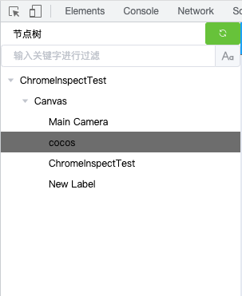
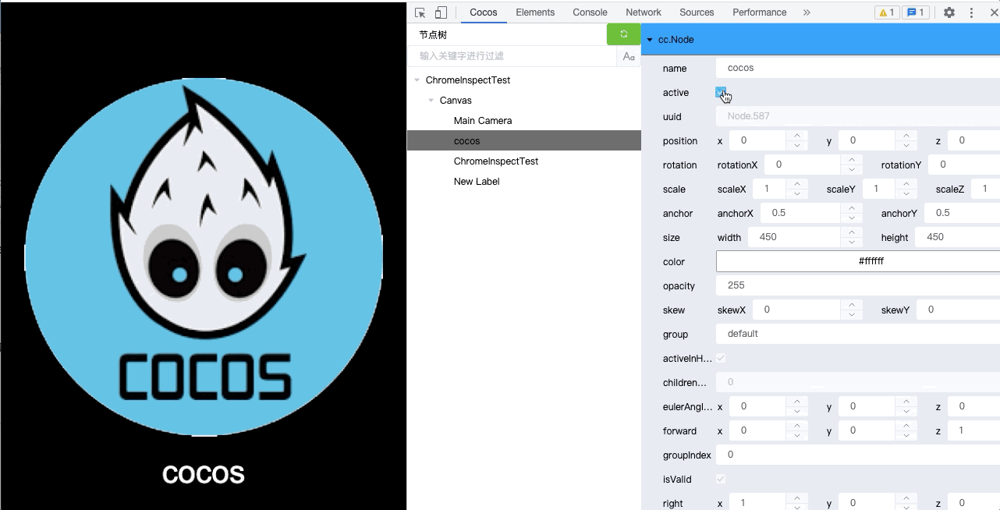

# cocos-creator-inspector
## 插件说明
本插件为chrome插件，方便在chrome浏览器中调试运行的creator游戏.

[视频教程，点击前往B站观看](https://www.bilibili.com/video/BV1Wq4y1u7Fj/)

<iframe src="//player.bilibili.com/player.html?aid=549224335&bvid=BV1Wq4y1u7Fj&cid=442178937&page=1" scrolling="no" border="0" frameborder="no" framespacing="0" allowfullscreen="true" height="900"> </iframe>

## 插件安装
- [点击查看如何安装](./docs/cc-inspector-v1/install.md)
 
## 如何使用
- 在chrome浏览器中运行creator开发的游戏
- F12打开**开发者工具**你会发现多了一个cocos选项
>
- 点击**刷新**按钮即可查看游戏运行时的节点目录树,左侧为节点,右侧为节点信息
> 
- 修改节点信息中active属性,将直接影响运行中的游戏效果
> 
