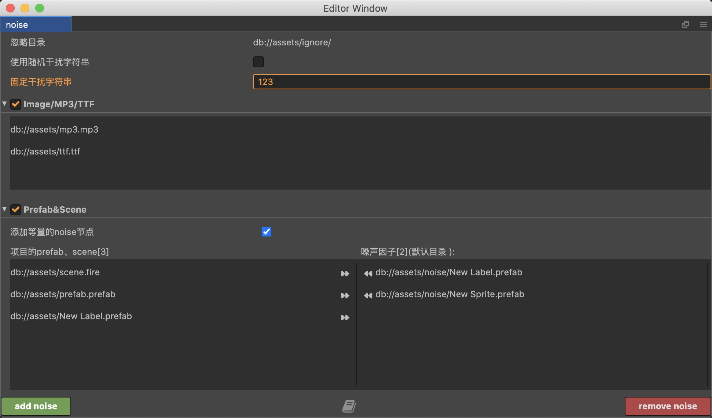

# 插件开发背景

众所周知，AppStore对应用有查重，当我们手里有一套源码时，为了能成功上架，我们需要对源码进行简单的修改，比如给prefab增加一些空节点、隐藏节点等，给图片追加一些无效数据。

同一套代码，我们如果制作多个马甲包，也需要用到类似的手段进行处理。

类似这样的修改对游戏的副作用最小，工作量也相对可预估，如果项目prefab、scene数量比较少，手动修改下也不是太麻烦，但是如果有非常多的prefab，这件事就需要考虑交给自动化去处理。
## 插件功能

1. 自动对prefab、scene添加指定的prefab，支持批量随机添加、一键解放你的双手。
2. 支持对MP3、Image、TTF进行非破坏性修改MD5，这样也能达到一定的迷惑效果。

# 使用细节
- 在`db://assets/ignore/`目录下的资源不会被插件检索，如果你不希望某些资源被混淆到，可以放在此目录
- 建议将noise prefab放在`db://assets/noise/`，插件会自动检索分类
- 因为切换prefab时，会先退出到scene，再打开新的pref，这是creator的实现机制，为了加快切换prefab的速度，建议scene尽可能简单，或者直接使用新建的空scene
- 添加等量的noise节点：从noise prefab中随机N个prefab，并添加这N个prefab，使得N个prefab的节点数量大于目标prefab节点的数量。

暂时只支持creator2.x，视情况开发支持3.x
# [视频教程](https://www.bilibili.com/video/BV1x94y1z7yA/)

<iframe src="//player.bilibili.com/player.html?bvid=BV1x94y1z7yA&page=1" scrolling="no" border="0" frameborder="no" framespacing="0" allowfullscreen="true" height="600"> </iframe>
