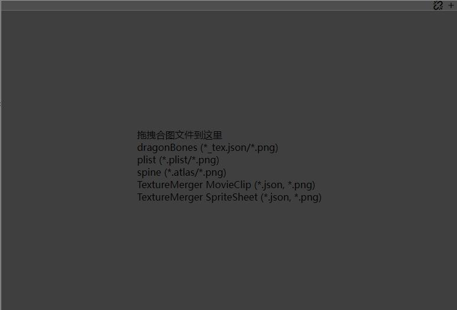
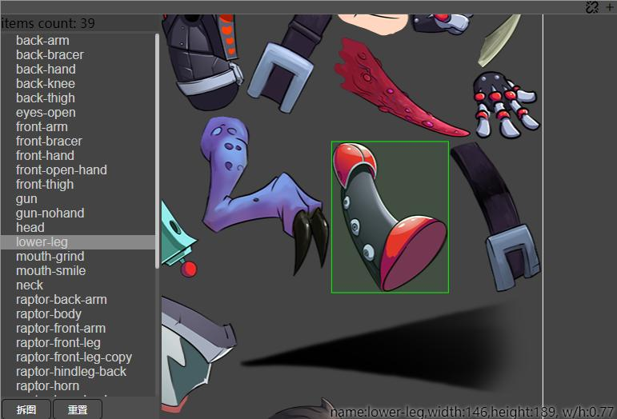
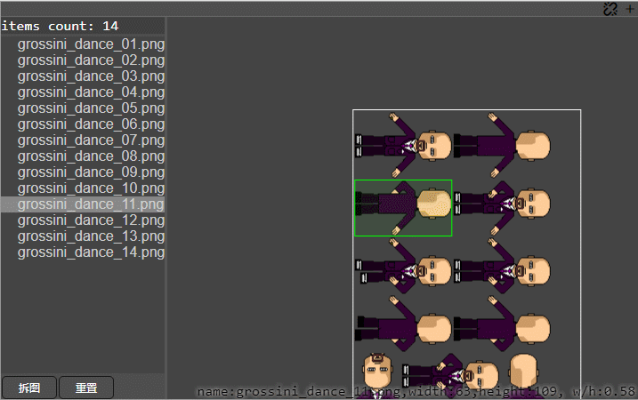

最好用的[拆图插件](https://store.cocos.com/app/detail/6060)，获得多位用户的五星好评，欢迎[在线试用](https://tidys.github.io/atlas-clipper/main.html)。

将图集拆分为散图文件，支持多种格式的合图拆分

- dragonBones
- spine
- plist
- egret textureMerger movie clip
- egret textureMerger sprite sheet
- 根据像素识别拆图
  
## 使用教程

1. 点击菜单`扩展/atlas-clipper`, 打开插件后如下

   

2. 拖拽对应的文件到插件中

   

3. 选择列表中的散图，可以查看对应区域的纹理
4. 点击`拆图`，即可下载拆分后的散图纹理
5. 支持多个预览实例对比，方便对比合图的差异。

## Plist动画预览

大部分情况下，我们都会选择将动画序列帧打包为一个plist，插件支持预览plist动画，方便观察动画效果。

增加了一些快捷键，方便使用：暂停动画、播放动画、查看上一帧、查看下一帧、调整播放帧率、显示隐藏参考线、调整offset。

如果发现plist打包后的动画效果会发生抖动，参考线和offset的相关功能，就是为了调整动画的抖动而开发的，修改offset后，将plist重新导出即可，一般我们不需要这个功能，当你发生动画播放抖动时，这个功能会帮你快速排查定位问题。

## 像素拆图

只有一张图片，却没有对应的plist配置文件，这种情况下，插件支持识别像素进行拆分。

需要注意图片必须有缝隙，否则无法识别出。

右键插件的图片预览区域，会弹窗`pixel split`菜单，选择即可进行像素识别拆分，过程可能比较耗时，需要耐心等待。

## 可能遇到的问题
1. 看图软件的旋转功能

  如果遇到拆图结果异常，大部分情况下plist文件不会有问题，可能是图片被意外修改导致的（`市面上的大部分看图软件的旋转功能都支持旋转保存`），可以尝试旋转调整图片后，重新导入拆分