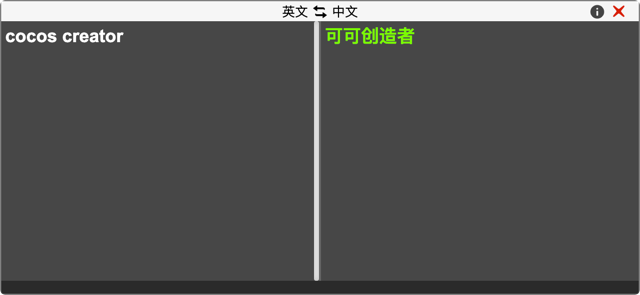

# 翻译助手
在creator使用过程中，组件属性名，文件夹命名，代码变量命名，都会有翻译的需求产生，虽然通过第三方工具也能解决这个问题，但毕竟没有插件支持来的方便。

该插件就是一款可以中英文翻译的插件，内置翻译引擎为microsoft bing翻译引擎。



## 特点
- 支持快捷键秒开窗口，即用即走
- 支持翻译单词和句子，无限次翻译

## 修改快捷键
插件默认使用的快捷键是`shift+1`，如果有需要修改，可以自行修改插件的`package.json`
- v2.x版本

待支持
  
- v3.x版本
```json
{
      "contributions": {
        "shortcuts": [
          {
            "message": "open-panel",
            "win": "shift+1",
            "mac": "shift+1"
          }
        ]
      }
}
```
  

## 更多功能
- 每日一词
- 单词本
- 单词发音
- 多翻译引擎支持


