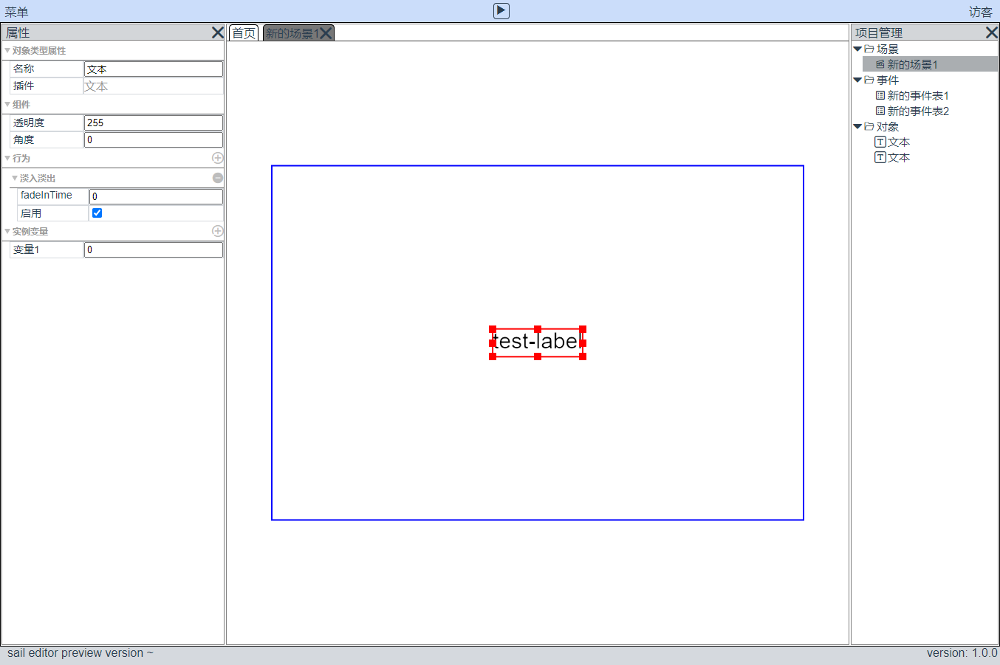
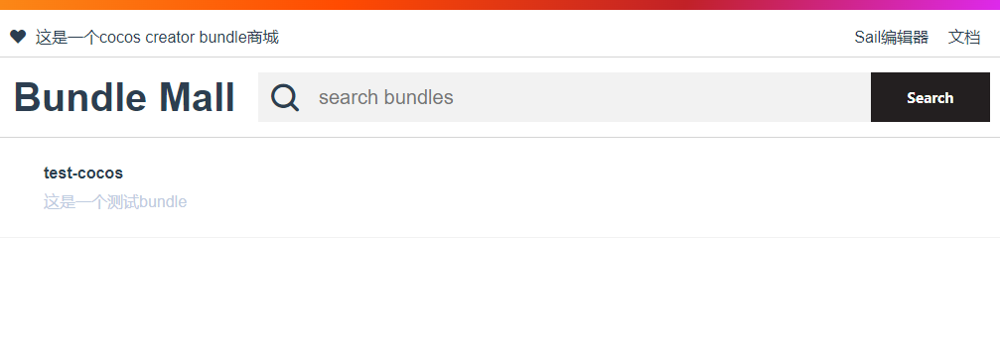

# sail

第一次接触construct3，真正的零代码，1分钟制作一个简单的平台跳跃游戏demo，一下子就抓住了我的心。

construct3发展至今，已经有11年的历史了，足以证明其在该领域的实力。

sail是一款从construct3获取灵感，针对cocos creator的bundle机制，进行深度定制的一款`less code game editor`，支持以bundle的形式扩展编辑器。

在线体验： http://tidys.gitee.io/game-wing/#/

开源地址： https://gitee.com/tidys/game-wing

# sail在做什么？

简单说：
> 将代码以bundle的形式沉淀下来，让游戏开发更简单，即使你不会写代码也能做游戏。

实际游戏开发过程中，良好的代码编写习惯，更倾向于将功能模块化。

cocos creator的bundle已经推出很长一段时间，bundle看起来是一个不错的积累方式。

有了bundle进行功能的分发还不够，将游戏真正的发布出来还有很多工作要做，sail的目标是提供一整套的解决方案。

## 适用人群

- 如果你是cocoser，可以通过编写自己的bundle，被sail加载，为sail增加新的功能。

- 如果你不是cocoser，可以通过sail的资源商店，寻找想要的bundle来制作游戏。

- 如果你有一些游戏想法，想要快速验证，sail这种形式的编辑器，是一个不错的选择，在itch.io上，有非常多construct3制作的demo，甚至每年的game jam上，都能看到construct3的制作身影。

- 最近备受打击的教育行业，在实际的课件开发过程中，其实也产生了类似的需求，将技术和内容制作人员，通过工具梳理清楚工作流，sail的探索可以作为一个新的参考。

## 编辑器

sail编辑器的灵感来自 [construct3](https://www.construct.net/en) 编辑器，所以你如果使用过construct3，就会发现有很多相似之处。

sail编辑器从底层就以bundle为基础进行功能的扩充搭建，所以支持开发编写插件扩展更多的编辑器功能。

参考construct3，在设计之初，sail就采用web的形式体验编辑器，这样也兼顾到到企业在局域网环境的免安装使用需求，当然对桌面软件的支持，sail也考虑在内。

## 资源仓库

开发者可以自己编写符合规范要求的cocos creator bundle，然后上传到资源仓库中，供sail编辑器使用。

目前仓库资源索引放在 [github仓库](https://github.com/game-sail/bundle-repo) ，国内通过jsdelivr提供的免费CDN服务进行加载。(不要问为什么，因为穷！)

后续可以灵活配置资源索引地址，这样企业就可以在局域网环境中内部使用，满足企业对内的需求。

# 期望目标
- web editor满足基本的内容制作需求
- editor的扩展性良好
- 资源商店bundle的多样性
- 局域网部署，开箱即用
- 探索制作更多种类游戏的的可能性
- 商业模式：参考construct3的订阅收费，技术支持。

> 开了一个大坑，bug非常多，请我喝个咖啡吧~