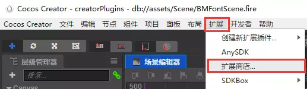
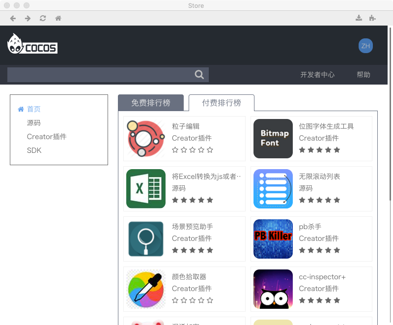
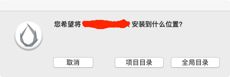
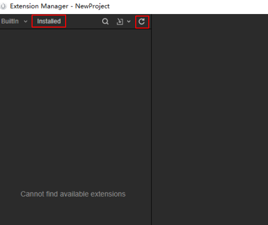
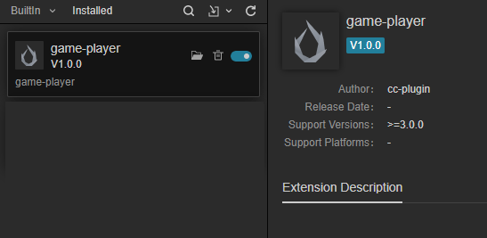
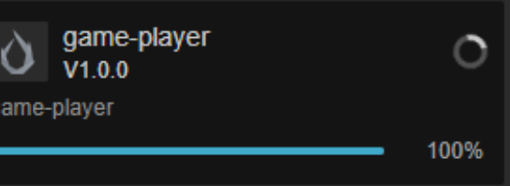

# Cocos Creator 插件基础知识

## 什么是Cocos Creator 插件
CocosCreator插件是基于CocosCreator运行的一种插件程序
- 只能运行在CocosCreator中,不能独立运行
- 插件的开发规范受CocosCreator的约束

## 如何下载插件
> 注意：随着cocos creator的版本更新，使用操作也会发生变化，请注意甄别，文档无法做到同步跟新。
CocosCreator有自己的[插件商店](http://store.cocos.com/),所有开发者提交的插件都会放在这里,要下载使用这些插件,你需要:
1. 下载并安装[Cocos Creator](https://www.cocos.com/history)
2. 打开cocos creator,在菜单中依次点击 扩展=>扩展商店, 来到插件商店
 
 
3. 选择自己喜欢的插件,下载安装使用吧! 
    安装过程中你会遇到安装提示

    
    
    - 项目目录: 只有本项目工程才能使用这个插件
    - 全局目录: 所有的Creator项目都可以使用这个插件

## 如何手动安装cocos creator插件
假设你手中有一份cocos creator插件

对于`cocos creator2.x`版本来说，你需要将插件放到项目的packages目录即可
- project
    - assets
    - packages
        - 插件1
        - 插件2
        
对于`cocos creator3.x`版本来说，你需要将插件放到项目的extensions目录即可，目录结构为
- project
    - assets
    - extensions
        - 插件1
        - 插件2
## 安装后注意事项
对于creator2.x，不能在打开creator项目的情况下安装插件，否则可能会无法正常加载到插件，这种情况下，需要重启下creator，再次打开后插件就能正常工作了，这是creator的机制导致的，目前暂时没有更好的解决办法。

对于creator3.x，安装完毕插件后，打开`Extension Manager`

点击`installed`如果没有看到安装的插件，可以尝试点击`刷新`按钮。

记得启用插件

如果插件一直无法正常启用，这种情况大概率还是因为在打开项目的情况下安装插件导致的，建议重启creator，目前没有啥好的解决办法。

## 如何移除插件
### 全局安装
- Mac     
>找到路径/Users/xxx/.CocosCreator/packages，这个目录保存了你安装的所有全局插件，删除对应的文件夹就好了。
- Windows   
>在C盘用户目录下也有这个文件夹，C:/用户/xxx/.CocosCreator/packages，也是删除插件对应的文件夹。

注意：.CocosCreator文件夹默认是隐藏的

### 项目安装
>找到 项目目录/packages/xxx, 删除xxx文件夹即可