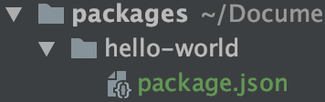
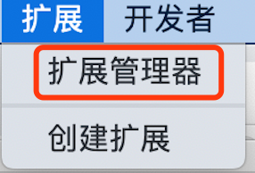
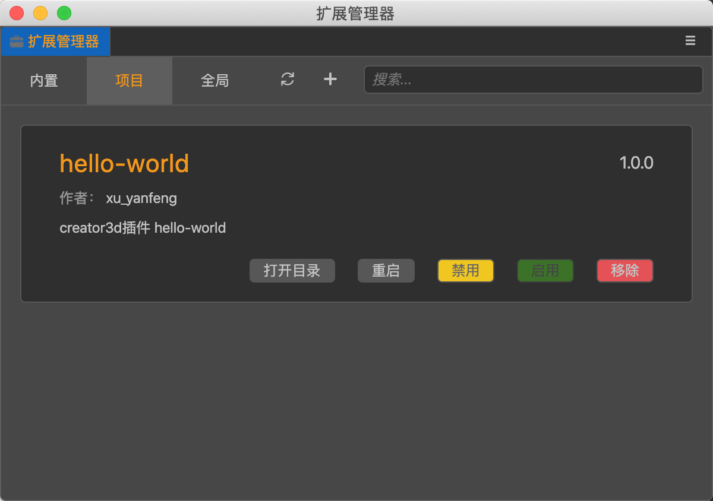

## CocosCreator3D插件教程(1)：hello-world

学任何新知识，最快的入门方式莫非`HelloWorld。`

本篇文章手把手带你，跟着我3步搞定，不需要编写一行代码，2分钟轻松入门creator3d插件。

### 1. 创建插件项目

我们需要先下载Cocos Dashboard，然后在Dashboard中下载creator3d，这里我使用的是v1.2.0：

res/image-20201024152937740.png)

新建并打开一个creator3d空项目，然后找到项目的packages目录，如下图所示新建对应的文件和目录：



### 2. 设置插件基本信息

我们在`package.json`里面定义一些插件信息。

比如插件名字、版本号、作者、描述等：

```json
{
  "name": "hello-world",
  "version": "1.0.0",
  "author": "xu_yanfeng",
  "description": "creator3d插件 hello-world"
}
```

### 3.在编辑器中查看插件

让我们回到creator3d编辑器中，点击菜单栏中的`扩展`->`扩展管理器`



打开`扩展管理器`面板，切换到`项目`选项卡，即可看到`hello-world`插件：



可以看到，展示的插件信息，就是我们刚刚在`package.json`里面定义的信息。

> 如果编辑器始终没有发现该插件，我们可以尝试重启编辑器。

因为目前我们还没有编写任何插件的逻辑，所以，`启用`按钮暂时不可用。


至此，我们的第一个插件就编写完毕了！是不是很easy！

现在插件还没有任何功能，在后续教程中，我们将一步一步完善！

