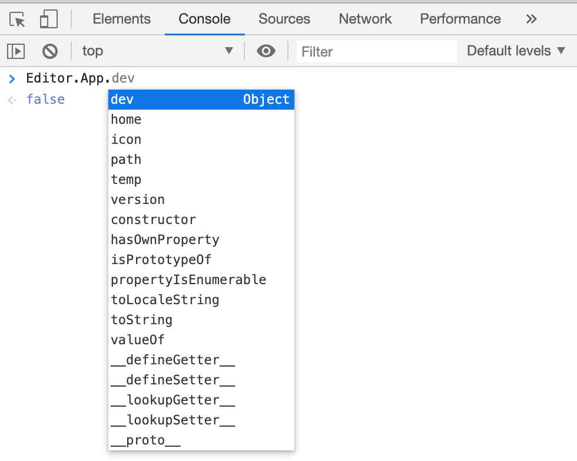

## CocosCreator3D插件教程(12)：调试插件

经过之前的学习，我们已经可以编写一个比较复杂的插件，编写逻辑的过程中，我们就需要调试，那么creator3d插件，应该如何调试呢？

### 1.万能的console

`console.log()`是最简单直接的方式，编辑器会捕获log，并且在编辑器的控制台进行打印显示。

显然这种方式只满足一些简单逻辑的调试，对于复杂的逻辑，我们必须依靠断点调试，才能准确定位问题。

### 2.进程？渲染进程，主进程？

在学习断点调试前，我们需要了解，插件的代码是分别运行在不同进程的。

`package.json`

```json
{
	"main": "./main.js",
	// ...
	"panels":{
		"default":{
			// ...
			"main":"./panel.js"
		}
	}
}
```

- `main.js`是运行在主进程

- `panel.js`是运行在渲染进程

##### 为什么会是这样子？

> 主要原因是`Creator编辑器`采用`Electron`(https://www.electronjs.org/)开发的。
>
> 大家可以自行搜索相关资料，了解更多`Electron`技术细节。


### 3.如何调试插件面板

我们写的所有插件面板逻辑，都是运行在渲染进程，你可以认为就是一个很普通的网页，很自然我们就想到了调试网页利器`devtools`，那么在Creator3D我们如何打开呢？


点击菜单栏的`开发者`/`开关开发人员工具`，就可以打开当前窗口的调试工具

> 注意：打开的当前激活窗口的调试工具


这里就不在详细介绍如何使用`devtools`了，这是开发creator游戏过程中，高频使用的工具。


### 4. 如何调试插件逻辑

目前creator插件并没有给出完整的解决方案，不过这里依旧有方法可以断点调试，详细调试方法见：https://mp.weixin.qq.com/s/KcU3EISXmn0xJd7XfwzR6Q


### 5.发现更多编辑器API

在`Devtools`中，当我们在控制台编写代码按下`.`时，会自动提示该对象拥有的属性、方法：



所以，我们可以通过`Console`探索编辑器更多的api接口，有些api可能没有在文档写明，但的确是可以使用，不过在使用这些api的时候慎重，随着版本的更新，有可能就会消失。


以上就是插件开发过程中，常用的一些调试手段和小技巧，希望对你有所帮助！


