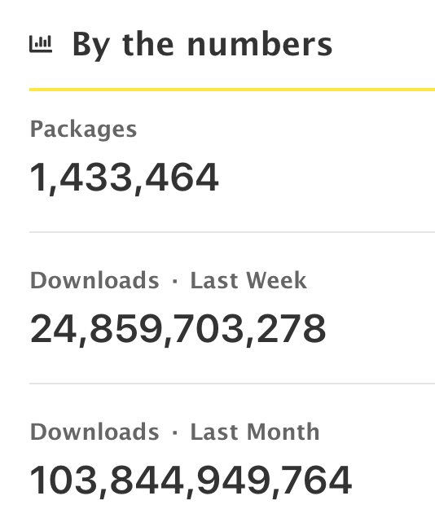
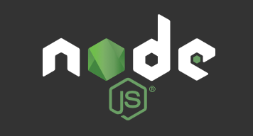
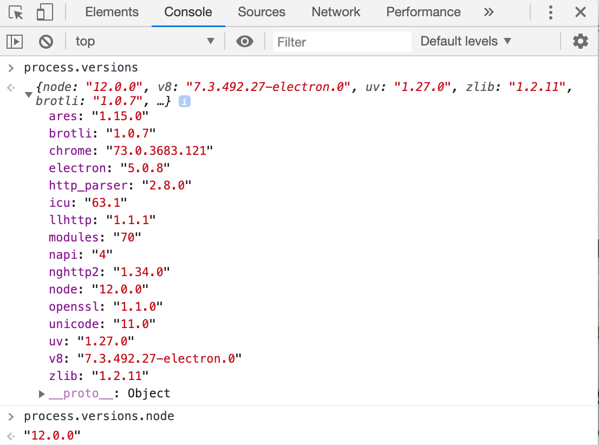
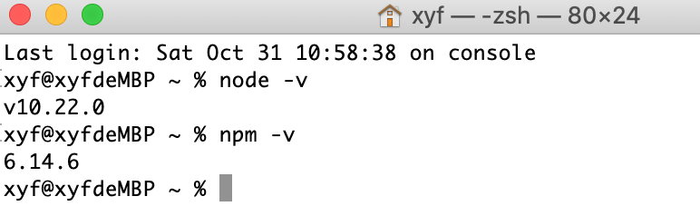
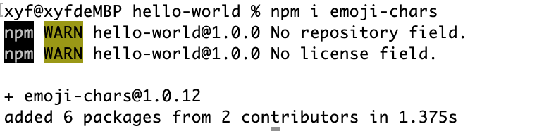
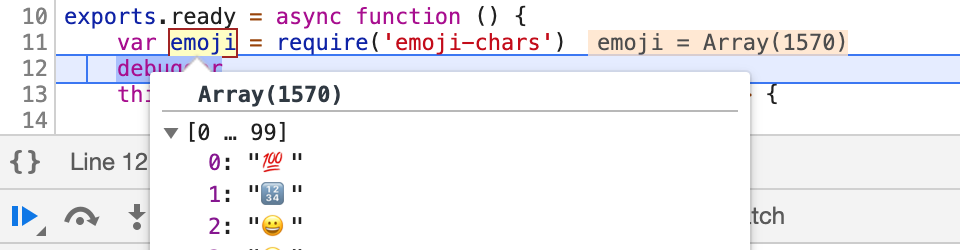

# CocosCreator3D插件教程(13)：插件&npm

### 1. 什么是npm

的扩展包，可以供nodejs开发者使用。



当然你也可以自己上传package，分享给别人使用(白嫖)。

实不相瞒，我本人经常会来此地使用(白嫖)一些`package`，是真的香啊！


### 2.使用npm，你需要安装nodejs环境



npm是和nodejs捆绑的，安装了nodejs，就可以开心的使用npm了。

你可以在中文官网(http://nodejs.cn/)找到对应的安装包，但是这么多nodejs版本，我应该选择哪个？

我个人对这个版本其实重视程度也不够，一般我都是用最新的啦。

但是如果你仍旧不放心，怕掉进坑里，你可以在查看下creator编辑器所使用的node版本，打开任何一个面板的`开发者工具`面板，如下图所示就能看到所有的版本信息：



这里有很多版本信息，编辑器是采用`electron`开发的，而`electron`又内置了`node`环境，大概就是这么个逻辑。

安装完毕`nodejs`，我们可以简单的确认下安装是否成功：



如果能正确显示node版本号，就说明可以正常使用了。


### 3.在插件中使用npm

一切准备就绪，这里我就以使用`emoji-chars`包举例：

- 在插件的`package.json`所在目录，安装`emoji-chars`

  > npm install emoji-chars



成功安装后，我们会发现`package.json`里面增加了刚刚我们安装的包

```json
{
  // ...
  "dependencies": {
    "emoji-chars": "^1.0.12"
  }
}
```

- 在插件代码中我们直接`require('emoji-chars')`就可以直接使用啦，非常方便




### 4.使用编辑器内置的package

creator3d编辑器中也使用了大量的package，如果你的插件也使用到了这些package，可以直接使用，这样也能减少插件包体积，但是并不能保证在后续编辑器中能够正常使用，还是存在一定的风险。

在插件中，你可以这样使用内置的package

```js
window.require('fs-extra');
window.require('execa');
window.require('express');
```

至于为什么要使用window，摸索出来的，具体原因没有深究。


### 5.关于npm，推荐给你的小技巧

- npm的常用命令，最好熟悉下。

- 使用`nrm`包，快速切换npm的仓库源，一键切换到`淘宝镜像`。

- 使用`n`包，快速切换nodejs版本。

- 并不是所有的`npm package`都能够在插件中正常使用，使用时需要仔细确认下。

- 有些`package`安装时需要编译一些原生代码，比如截图取色的`robotjs`，这个包就需要在`npm install`时编译一些目标平台的代码，这里就不再展开了，可自行百度`node-gyp`了解下，后续会推出一篇教程详细介绍下。

  

以上就是本篇教程，如果大家关于`npm`有啥想说的，可以评论区交流分享。

