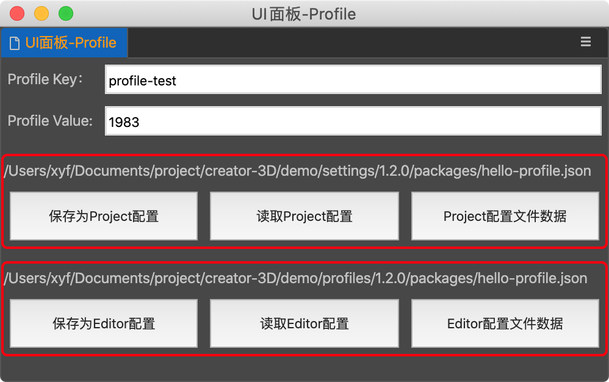

## CocosCreator3D插件教程(16)：为插件添加配置文件

在上一篇教程中，我们手动实现了为插件面板添加对应的配置文件，以满足保存配置的需求。

在creator3D插件中，早已经考虑到了这个需求：

### 1.设置*配置文件*信息：

在`package.json`中增加如下配置：

```json
{
	// ...
	"contributions": {
    "profile": {
      "editor": {
        "editor-cfg": {
          "default": 100,
          "label": "编辑器配置"
        }
      },
      "project": {
        "project-cfg": {
          "default": 200,
          "label": "项目配置"
        }
      }
    }
  }
}        
```

在`contributions`中新增`profile`字段中，定义`editor`和`project`2种类型的配置。

- `editor`：一般保存编辑器相关的配置，比如编辑器的偏好设置等。

  > `项目目录`/`profiles`/`1.2.0(编辑器版本号)`/`packages`/`hello-world.json(插件名.json)`

  ```js
  await Editor.Profile.setConfig('hello-world', 'editor-cfg', 101);
  let value = await Editor.Profile.getConfig('hello-world', 'editor-cfg');
  ```

- `project`：一般保存项目相关的配置，比如编辑器的构建配置。

  > `项目目录`/`settings`/`1.2.0(编辑器版本号)`/`packages`/`hello-world.json(插件名.json)`

  ```js
  await Editor.Profile.setProject('hello-world', 'project-cfg', 201);
  let value = await Editor.Profile.getProject('hello-world', 'project-cfg');
  ```

目前profile里面的字段还不支持自定义。

关于Profile文件与profile配置`editor`、`project`之间的关系，我这里整理了一个小DEMO，方便加深理解，有需要的朋友自取：

https://gitee.com/tidys/creator3d_plugin_case/tree/master/hello-profile



如果你还记得上一篇我们手动实现的读写配置，那么再来看编辑器提供的接口，原理其实都差不多，如果插件接口仍旧满足不了个人需求，相信自己实现，也能得心应手了。

### 2.配置修改触发message

插件提供了`当字段发生修改时，会触发对应的message消息`的功能。

```json
{
	// ...
	"contributions": {
    "profile": {
      "project": {
        "project-cfg": {
          "default": 200,
          "message": "projectCfgChanged",
          "label": "项目配置"
        }
      }
    }
  }
}    
```

如上图所示，我们可以给字段设置`message`，当我们使用接口修改配置时：

````js
await Editor.Profile.setProject('hello-world', 'project-cfg', 201);
````

就会触发设置的消息名字，我们可以利用这个消息，实现多个面板间的配置信息同步。

以上就是插件配置系统，希望能帮助你更加深刻的理解。

