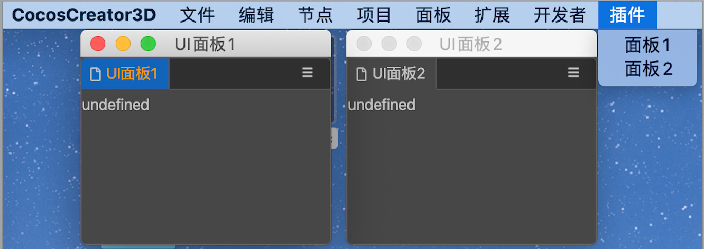
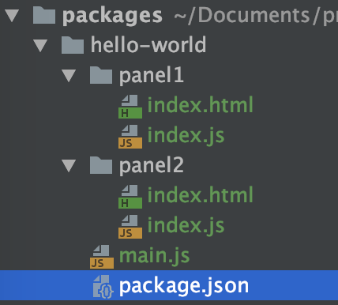
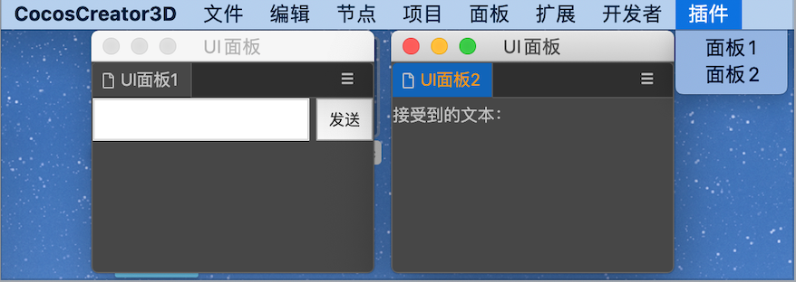
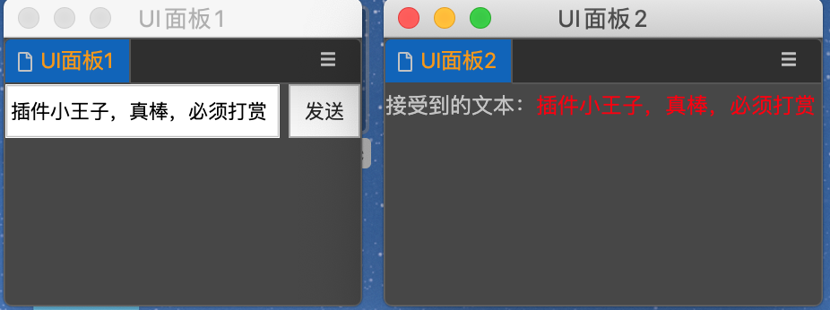

## CocosCreator3D插件教程(17)：插件多个面板之间交互

### 1.给插件配置2个面板，并设置打开菜单

首先我们先在`package.json`中配置2个面板：

```json
{
	// ...
  "panels": {
    "panel1": {
      "title": "UI面板1",
      "type": "dockable",
      "main": "./panel1/index.js"
    },
    "panel2": {
      "title": "UI面板2",
      "type": "dockable",
      "main": "./panel2/index.js"
    }
  }
}
```

然后在`package.json`我们分别增加2个菜单，用来打开这2个面板：

```json
{
  // ...
  "main": "./man.js",
  "contributions": {
    "menu": [
      {
        "path": "插件",
        "label": "面板1",
        "message": "openPanel1"
      },
      {
        "path": "插件",
        "label": "面板2",
        "message": "openPanel2"
      }
    ],
    "messages": {
      "openPanel1": {
        "methods": ["openPanel1"]
      },
      "openPanel2": {
        "methods": ["openPanel2"]
      }
    }
  }
}
```

在`main.js`中，我们实现打开面板的这2个消息：

```js
exports.methods = {
		// ...
    openPanel1 () {
        Editor.Panel.open('hello-world.panel1');
    },
    openPanel2 () {
        Editor.Panel.open('hello-world.panel2');
    },
}
```

这样我们就准备好了2个面板，通过菜单就能打开，目前还看不到任何UI。



此时我们的项目结构大致是这样子的：




### 2.编写2个面板的UI。

我们大致要实现的功能是：在面板1发送数据，在面板2接受并显示出来，如下图所示



#### 我们先来实现面板1的界面逻辑：

`panel1/index.html`

```html
<div style="display: flex; flex-direction: row;">
    <input id="input" type="text" style="flex: 1;"/>
    <button id="btn" style="width: 40px;height: 30px;margin-left: 5px;" @click="onBtnClick">
        发送
    </button>
</div>
```

`panel1/index.jss`

```js
const Path = require('path');
const Fs = require('fs');
exports.template = Fs.readFileSync(Path.join(__dirname, 'index.html'), 'utf-8');

exports.$ = {
    btn: '#btn',
    input: '#input'
}

exports.ready = async function () {
    this.$.btn.addEventListener('click', async () => {
         // 点击发送
    });
}
```

##### 再实现面板2的界面逻辑：

`panel2/index.html`

```html
<div>
    接受到的文本：<span id="text" style="color: red;"></span>
</div>
```

`panel2/index.js`

```js
const Path = require('path');
const Fs = require('fs');
exports.template = Fs.readFileSync(Path.join(__dirname, 'index.html'), 'utf-8');

exports.$ = {
    text: '#text'
}
```

### 3.进行界面数据交互

经过前2步的准备工作，下边就是本教程的重点内容了。

根据我们之前所学习到的，通过消息才能相互传递数据。

我们先梳理下大致的思路：

1. `面板1`输入数据，点击发送按钮，会发送给插件一个`message`
2. 插件触发对应的message，将数据转发给`面板2`
3. `面板2`接收并显示数据

我们接下来就按照这个思路进行：

`panel1/index.js`中我们点击发送按钮，给插件发送一条message，数据为输入框的值：

```js
// ...
exports.ready = async function () {
    this.$.btn.addEventListener('click', async () => {
        let data = this.$.input.value;
        Editor.Message.send('hello-world', 'panel1-panel2-data', data)
    });
}
```

在`package.json`中我们定义消息

```json
{
	// ...
  "contrubutions": {
    "messages": {
      /// ...
      "panel1-panel2-data": {
        "methods": ["panel2.onReceiveData"]
      }
    }
  }
}
```

注意：`panel2.onReceiveData`和之前的格式不太一样，以`.`进行分割表示面板消息(panel.method)。

面板消息最终会被派发到具体的面板(panel.js / methods)，不会被派发到插件(main.js / methods)。

因为我们需要在`panel2.js`里面接收这个消息：

```js
// ...
exports.methods = {
    onReceiveData (data) {
        this.$.text.innerText = data.toString();
    }
}
```

> `onReceiveData`一定要和`package.json`里面定义的面板消息(pane.method)一致！

至此，我们就顺利完成了，将面板1的数据，传递到面板2并显示出来。



本教程的代码量可能有点大，相关代码我已经放到gitee，有需要的自取。

https://gitee.com/tidys/creator3d_plugin_case/tree/master/case2


