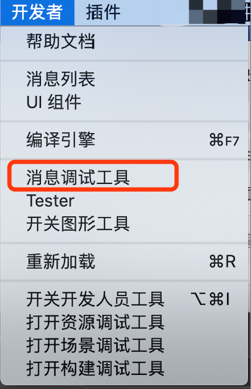
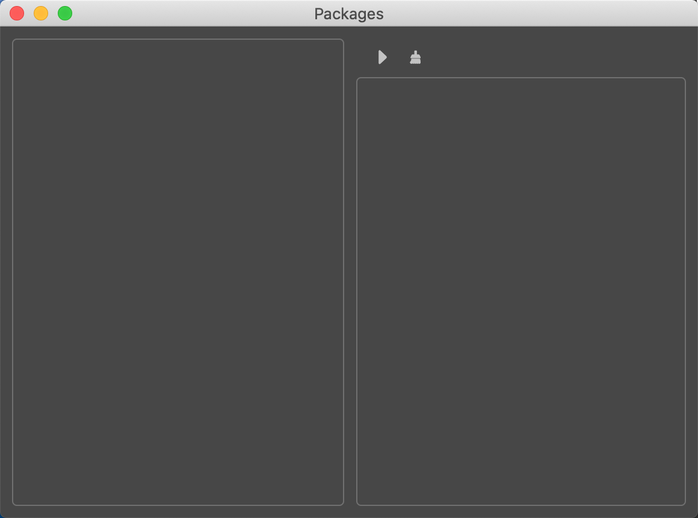
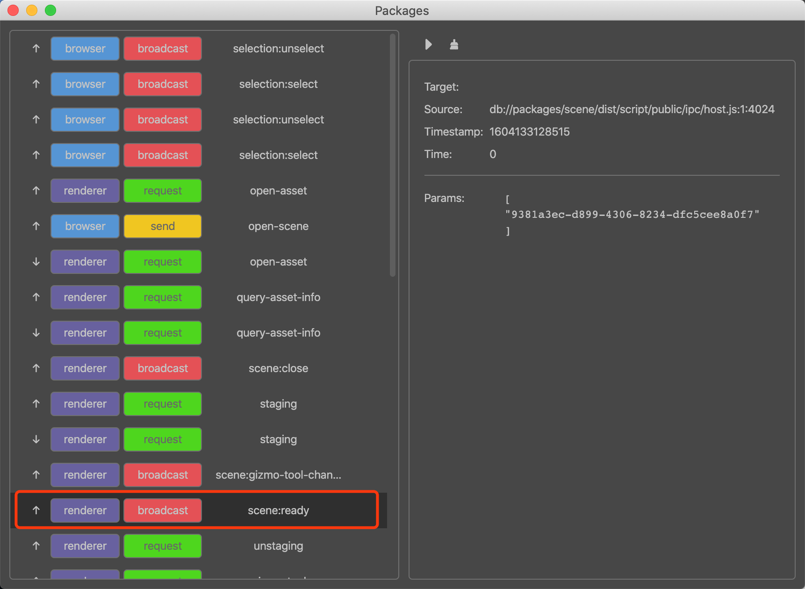
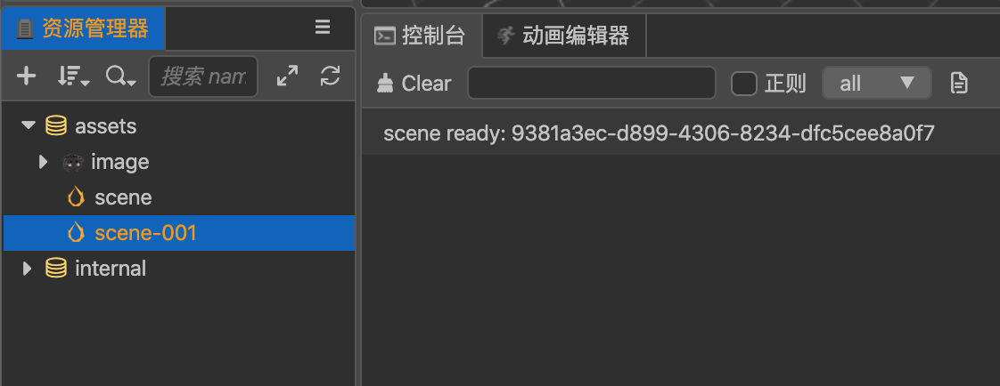

# CocosCreator3D插件教程(19)：插件监听编辑器事件
目前文档中并没有非常明确的罗列出来编辑器有哪些消息可以使用。

但是在编辑器中提供了另外一种方式，可以让我们了解到所有的可用消息。

### 1.打开消息调试工具

在菜单栏找到`开发者`/`消息调试工具`：



打开消息调试面板：



该消息面板会捕获到整个编辑器(包括插件)的所有`messages`

点击▶后，就进入监听捕获消息啦，我们尝试着切换2个scene:



看起来消息非常多呀，花花绿绿挺好看的，有兴趣的朋友，可以整理下。

这里我们重点关注下`scene:ready`，这是个`broadcast`广播类型的消息，也只有这种类型的消息才可以被任何插件所使用的。

那我们的插件该如何监听这个消息呢？


### 2.插件监听编辑器消息

以`scene:ready`为例：

在`package.json`监听该消息，和我们之前定义消息的方式一样：

```json
{
  "main": "./main.js",
	"contributions":{
		"messages":[
			{
				 // ...
			   "scene:ready": {
            "methods": [
              "onSceneReady"
            ]
        }
			}
		]
	}
}
```

在`main.js`中接收处理：

```json
exports.methods = {
  	// ...
    onSceneReady (data) {
        console.log('scene ready:', data);
    }
}
```

然后我们回到编辑器中，切换scene，就会发现可以正常响应触发我们的逻辑。



授人以鱼，不如授人以渔，虽然目前文档上并没有明确写明编辑器的所有可用消息，但是编辑器的`消息调试工具`胜似文档，可惜并不保证有些消息，会伴随版本消失，所以使用上，大家还是慎重！

在书写消息配置时需要手动码字，到目前为止，有太多的信息都集中在`package.json`，非常的麻烦而且容易出错。

如果精力允许，小王子会编写vscode插件，可视化管理`package.json`，想想都非常的期待。


