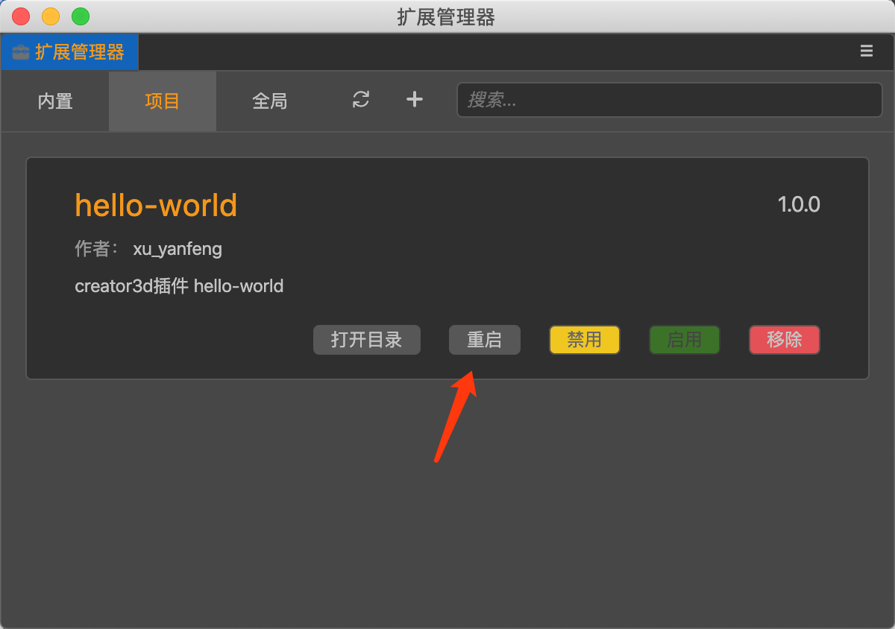
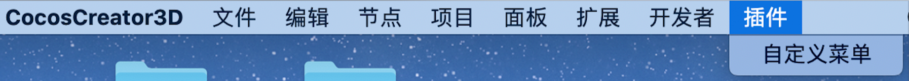

## CocosCreator3D插件教程(2)：给插件添加菜单

在上一篇教程中，我们创建了一个插件，并且可以成功被编辑器所识别、加载。

有时我们希望能够在编辑器菜单栏中，能够显示插件自己的菜单。


在creator3D插件里面，自定义插件菜单，非常简单：

### 1.定义插件菜单

打开插件的`package.json`文件，

```json
{
  "name": "hello-world",
  "version": "1.0.0",
  "author": "xu_yanfeng",
  "description": "creator3d插件 hello-world",
  "contributions": {
    "menu": [
      {
        "path": "插件",
        "label": "自定义菜单"
      }
    ]
  }
}
```

如上所示，增加`contributions`属性，并在里面增加`menu`来自定义插件菜单。

- `path`：插件菜单的显示位置，支持`a/b/c`表示多级菜单。
- `label`：菜单名字。

> `contributions`是creator3D插件中非常重要的一个配置属性，大部分插件功能都是配置在里面。

### 2.在编辑器中查看插件菜单

回到编辑器中，发现菜单栏并没有出现刚刚我们定义的新菜单。

我们打开`扩展管理器`，点击`重启`(必要情况下，可能得重启下编辑器)。



此时，我们刚刚定义的菜单，已经成功显示在编辑器的菜单栏中。



但是我们点击菜单，没有任何反应，在下一篇教程中，我们给菜单增加一些逻辑。

