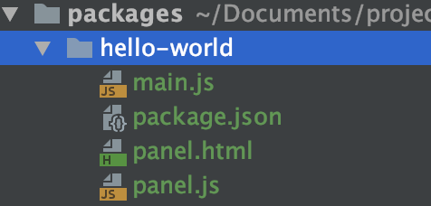
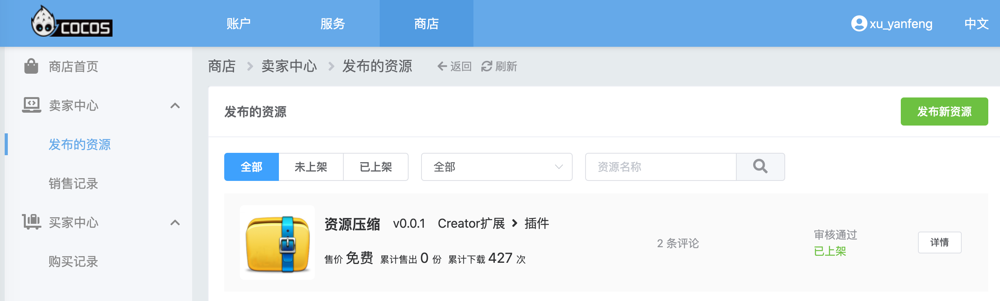
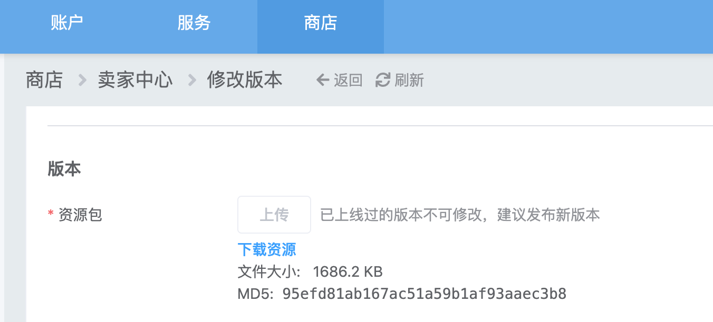
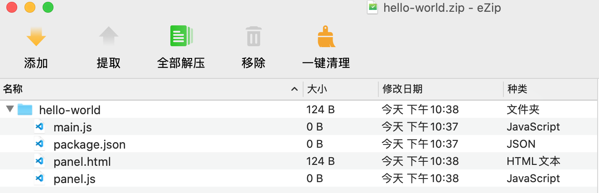

## CocosCreator3D插件教程(19)：分享售卖插件

当你历尽千辛万苦，从无数个坑中爬出来后，终于完成了自己的第一款插件，有木有非常有成就感？

### 分享给别人

插件完成了，同事也想借来使(bai)用(piao)一下，怎么分享给他呢？

你只需要将插件整体copy给同事即可：

就像上图所示：`项目目录`/`packages`/`hello-world`，只要保证最终是这样的目录结构，那么插件就能够正常使用。

如果使用了`npm`的`packages`，需要将`node_modules`目录也一并打包了。

### 分享到插件商店

独乐乐不如与众乐，不妨将你的插件上传到官方插件商店。

你可以免费共享给大家，让更多的人下载使(bai)用(piao)。

你也可以明码标价，售卖你的劳动成果。

首先你需要注册一个cocos账号，打开商店主页(http://store-my.cocos.com)，根据提示注册账号进入后台：

点击发布新资源，按照提示填写一些插件信息，需要注意的是，我们上传资源包是我们插件根目录的zip：

有不少小伙伴，对于zip目录并不是很清楚，到底这个zip包的目录结构是怎样的呢?

上图是CocosCreator2D插件目前的zip结构，也就是zip包中必须包含插件的根目录。

鉴于目前CocosCreator3D插件并不支持发布到商店，目录结构规范从文档来看似乎也不太一致。

这不坑爹的么，小王子立刻拍桌子正面刚枪，要求编辑器支持打包zip，方便上传到商店，无需开发者手动zip。

### 提交审核

一切准备就绪，只等官方审核结果，一般提审3个工作日内都会有结果，如果审核失败，你的coocos账号绑定的邮箱会收到一封邮件，里面会详细说明原因。

如果连续7个工作日审核工作都没有进展，大概率是审核小哥哥忘记了，这时，最好的办法就是论坛吐槽，每天都有cocos的相关技术支持同学收集论坛讯息。

最后，有任何插件相关的问题，如果找不到相关人员反馈，请不要忘记我。

毕竟也客串很久插件客服的工作了，你一张嘴，我就知道你想问啥。

