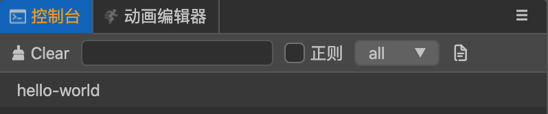

##  CocosCreator3D插件教程(3)：给插件菜单添加逻辑

在上篇教程中，我们的插件成功向编辑器中添加了菜单。

点击菜单我们需要编写一些自己的逻辑，我们该如何做呢？

首先我们需要知道，插件整体的设计理念是：**消息**。

### 1. 设置插件菜单的响应消息

如下所示，我们修改下`package.json`：

```json
{
	// ...
  "contributions": {
    "menu": [
      {
        "path": "插件",
        "label": "自定义菜单",
        "message": "onMenuClick"
      }
    ],
    "messages": {
      "onMenuClick": {
        "methods": [
          "log"
        ]
      }
    }
  }
}
```

- 给菜单添加一个`message`属性，属性值就是响应的消息名字`onMenuClick`。

- 插件新增了一个`messages`字段，这里面定义了整个插件的所有消息，包括菜单的响应消息。

从配置中，不难发现`onMenuClick`消息最终要调用`log`方法，那么`log`方法的具体逻辑，又该写在哪里呢？

### 2.编写消息的具体逻辑

在`package.json`里面，我们给插件新增一个`main`字段，给插件绑定一个脚本，之后所有插件相关的逻辑，我们都写在这里。

```json
{
	// ...
  "main": "./main.js",
  // ...
}
```

我们在插件当前目录，新建一个`main.js`，


并新增一个`log`方法:

> 这里的`log`一定要和消息`onMenuClick`里面设置的消息名字一致，才能正确关联触发。

```javascript
exports.methods = {
    log () {
        console.log('hello-world');
    }
}
```

### 3.编辑器中测试下

回到编辑器中，和之前一样，我们需要在`扩展面板`重启并启用下插件(必要情况下，可能得重启下编辑器)。

然后我们点击插件的菜单，就能在控制台打印`hello-world`。



整个过程还是比较绕，在后续，我将会详细的给大家详细介绍下`插件消息`，帮助你更好的理解消息机制。

