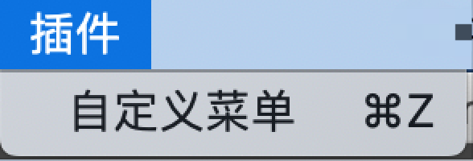
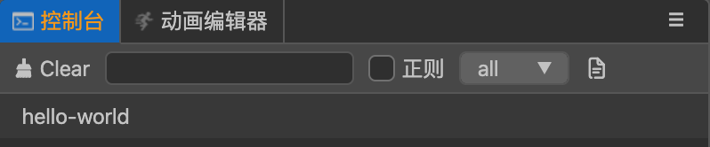

## CocosCreator3D插件教程(4)：给插件添加快捷键

我们日常使用的软件，一般都有快捷键，插件同样也支持啦。

creator3D插件中设置快捷键非常简单，我们需要这样做：

### 1. 配置快捷键

如下所示，修改`package.json`：

```json
{
	// ...
  "contributions": {
  	// ...
    "shortcuts": [
      {
        "message": "onMenuClick",
        "win": "ctrl+z",
        "mac": "cmd+z"
      }
    ]
  }
}
```

我们在`contributions`中，新增一个`shortcuts`字段，

- `win/mac`：绑定快捷键，可以在不同平台绑定不同的快捷键。
- `message`：触发的消息名字，和菜单绑定消息一样。

这里我直接绑定了菜单的消息，当然，你也可以重新绑定新的消息，具体参考上节教程。

### 2. 编辑器中测试下

回到编辑器中，和之前一样，我们需要在`扩展面板`中`重启`并`启用`下插件(必要情况下，可能得重启下编辑器)。

同时我们会发现编辑器菜单上，多了快捷键信息。



我们在编辑器中，按下快捷键`cmd/ctrl+z`，和上节教程中点击菜单效果一样，会在控制台打印`hello-world`。



可以看到绑定快捷键非常简单，整个消息机制还是非常灵活的。

在实际的开发过程中，理论上快捷键应该是更好的去服务一些高频常用的功能，如果绑定大量的快捷键反而会适得其反，所以，快捷键尽量不要滥用。

