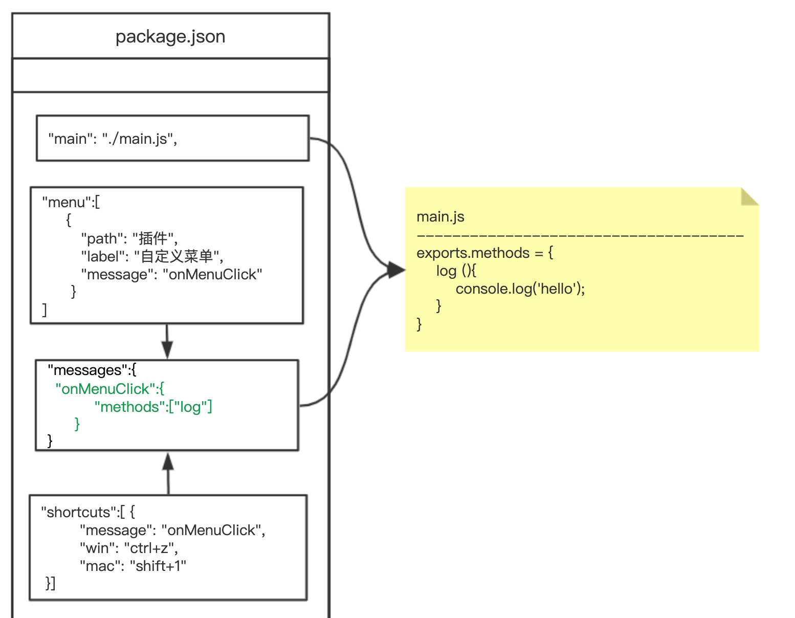

## CocosCreator3D插件教程(5)：消息机制详解

之前的教程，我们给插件添加菜单、编写菜单的响应逻辑、添加快捷键。

不难发现，要想玩转creator 3d插件，就必须要理解`messages`！！！

我们梳理下之前的代码：

- `package.json`：描述插件，包括名字、作者、版本、菜单、快捷键、消息等

```json
{
  "name": "hello-world",
  "version": "1.0.0",
  "author": "xu_yanfeng",
  "main": "./main.js",
  "description": "creator3d插件",
  "contributions": {
    "menu": [
      {"message": "onMenuClick","path": "插件","label": "自定义菜单"}
    ],
    "shortcuts": [
      {"message": "onMenuClick","win": "ctrl+z","mac": "cmd+z"}
    ],
    "messages": {
      "onMenuClick": {"methods": ["log"]}
    }
  }
}
```

- `main.js`：插件的逻辑，消息的具体实现是写在这里面

```javascript
exports.methods = {
    log () {
        console.log('hello-world')
    }
}
```

我们再次梳理下整个流程，加深下印象：

- 当我们点击菜单时，会触发设置的`onMenuClick`消息，然后`onMenuClick`消息会执行具体对应方法`log`。
- 当我们按下快捷键时，会触发设置的`onMenuClick`消息，然后`onMenuClick`消息会执行具体对应方法`log`。

我顺便整理了一张图，从图中，能够更加形象的感知之间的关系：



我们可以看到，利用消息机制，插件做到了设计上的完全解耦，非常的灵活，但同时也增加了理解难度，编写时也更叫容易犯错，有得必有失嘛！

悄悄的告诉大家，creator3D编辑器本身也在使用这套消息机制，并得到了充分的验证，这也充分说明这套消息机制，是完全可以胜任并满足比较复杂的插件需求，不过在易用性，还有待提高。

至此，如果你要编写的插件如果没有UI面板交互，基本上只需要掌握到本节的知识即可，在后续教程中，将会重点介绍插件UI面板相关的开发教程。

